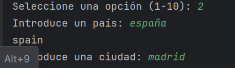
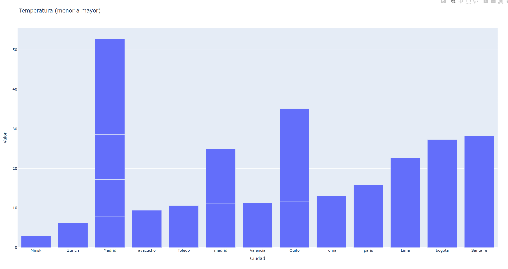
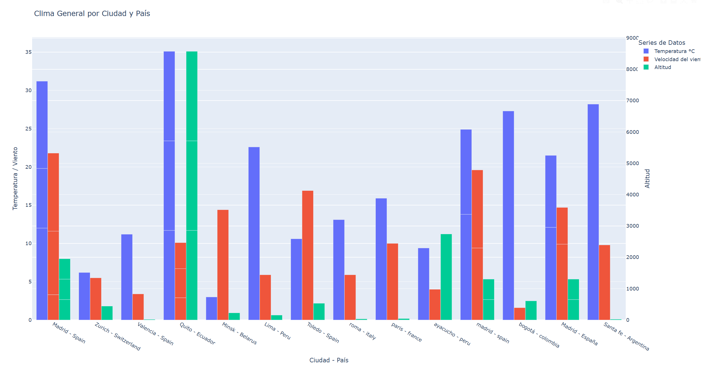
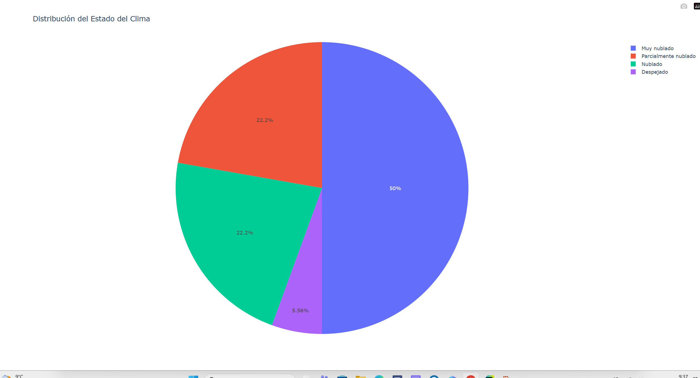

## 🌦️ Diseño del proyecto

📊 Analizador Climático – ClimaPy

ClimaPy es una aplicación desarrollada en Python que permite consultar y analizar información meteorológica de cualquier ciudad, especificando también su país. Obtiene datos climáticos en tiempo real de una fuente confiable en Internet para que los usuarios puedan ver la temperatura, velocidad del viento y otros aspectos del clima.

 **Diferencias del proyecto:**

📁 Crea un historial de datos de diferentes ciudades.

📊 Genera gráficos para su fácil comprensión.

📝 Permite documentación y análisis de datos climáticos.


## 🎯 Objetivos

El usuario tendrá que introducir los datos mediante la consola, introduciendo el país y la ciudad.



Una vez solicitados estos datos:

Se obtendrá la latitud y la longitud mediante una primera API.

Después se llamará a una segunda API, pasándole la latitud y longitud obtenidas.

Con estas coordenadas se obtendrá información del clima en tiempo real.

Los datos obtenidos se almacenarán en un archivo Excel, que actuará como base de datos con columnas para la información climática.

En nuestro caso hemos elegido **Excel**


El menú principal contará con 10 opciones:


Las opciones 1 y 2 servirán para introducir y eliminar registros climáticos en Excel.

El resto de opciones (excepto la 10) usarán Pandas para filtrar datos.

Los datos filtrados se usarán para construir gráficos con Plotly para comparar cambios climáticos.

**Gráfico de barras**



**Gráfico de barrasAgrupado**



**Gráfico radial**



## 🏗️ Estructura y funcionalidad principal

Las funciones principales de la aplicación permiten al usuario obtener información del clima en tiempo real de un país y ciudad mediante una interfaz gráfica o consola.

El usuario podrá consultar:

**🌡️ Temperatura en grados Celsius (°C)**

**🏔️ Altitud**

**💨 Velocidad del viento**

**🧭 Dirección del viento:**

Norte

Sur

Este

Oeste

Suroeste

Noroeste

**☁️ Estado del clima:**

Nublado

Despejado

Lloviendo

Soleado

Además podrá consultar:

**🔺 Temperatura máxima**

**🌪️ Máxima velocidad del viento**

## 🧩 Clases del proyecto


Se contará con tres clases principales:

**1️⃣ Clase Main**

La clase Main es la encargada del funcionamiento principal de la aplicación. Controla la interacción del usuario e inicia las consultas cuando se introducen los datos en la aplicación.

**2️⃣ Clase ApiClient**

La clase ApiClient es la encargada de realizar las llamadas a las correspondientes APIs para obtener:

Latitud

Longitud

Datos climáticos en tiempo real

**3️⃣ Clase Analisis**

La clase Analisis sirve para filtrar los datos que el usuario desea obtener, permitiendo procesar la información almacenada en Excel y preparar los datos para su análisis y visualización.

**4️⃣ Clase interfaz**

Esta clase Interfaz sirve para procesar los datos que se han almacenado en excel, y generar gráficos con ellos


## 📰 Diagrama de Flujo

```
INICIO
   ↓
Mostrar mensaje de bienvenida
   ↓
Solicitar país y ciudad
   ↓
¿Datos válidos?
   ↓           ↓
  NO           SÍ
   ↓           ↓
Mostrar error  Conectar con API
               ↓
        ¿Respuesta correcta?
               ↓         ↓
              NO         SÍ
               ↓          ↓
        Mostrar error   Procesar datos
                          ↓
                    Mostrar información
                          ↓
                   Guardar en historial
                          ↓
                   Generar gráfico
                          ↓
                         FIN
```


